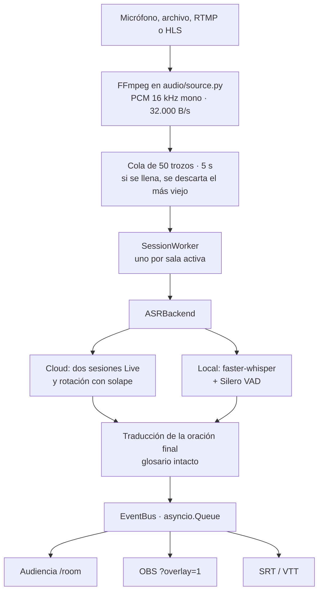
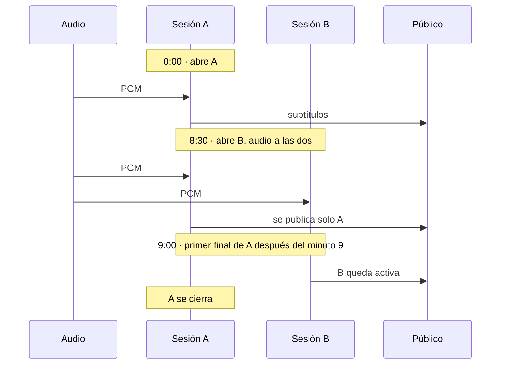

# NejoyT

Subtitulado y traducción en vivo para conferencias de varias salas.

Pensado para **Nerdearla 2026**. Open source. Una charla puede durar lo que dure: el audio no se corta cuando la sesión de streaming llega a su límite.

[](LICENSE)


Un proceso recibe el audio de la sala, lo transcribe con glosario técnico y publica subtítulos en español, inglés o portugués. La audiencia los ve en el navegador. El streaming los incrusta en OBS. Al terminar, la charla se exporta a SRT.

```
Mic / archivo / RTMP / HLS
        │  FFmpeg → PCM 16 kHz mono
        ▼
   Transcripción en vivo          Rotación a los 9 min, con 30 s de solape
        │
        ▼
   Traducción de la oración cerrada
        │
        ├── /room/…            audiencia
        ├── ?overlay=1         OBS
        └── export             SRT / VTT
```

| | |
|---|---|
| Audio | Micrófono, archivo, RTMP o HLS. Siempre vía FFmpeg. |
| Nube | `gemini-3.5-transcribe-live` + traducción Flash. |
| Local | faster-whisper, Silero VAD y traducción en la máquina. Sin cuota. |
| Salas | Un proceso aguanta unas 10–15 salas y menos de 250 MB de RAM. |
| Control | Panel en `/admin`: crear, iniciar, pausar y editar el glosario en caliente. |

## Índice

- [Arranque](#arranque)
- [Probar con el audio de ejemplo](#probar-con-el-audio-de-ejemplo)
- [Qué problema cierra](#qué-problema-cierra)
- [Recorrido de una sala](#recorrido-de-una-sala)
- [Arquitectura](#arquitectura)
- [Rotación con solape](#rotación-con-solape)
- [Dos backends](#dos-backends)
- [Traducción](#traducción)
- [Operar el evento](#operar-el-evento)
- [Configuración](#configuración)
- [Rutas](#rutas)
- [Escala](#escala)
- [Mapa del código](#mapa-del-código)
- [Cuando algo no arranca](#cuando-algo-no-arranca)
- [Licencia](#licencia)

## Arranque

Hace falta Docker, o Python 3.12 con [uv](https://github.com/astral-sh/uv) y FFmpeg. La clave de Gemini es opcional: sin ella el sistema queda en local.

### Docker

```bash
cp .env.example .env
docker compose up --build -d
docker compose logs -f nejoyt
```

En Windows también vale doble clic en `start.bat`. Para bajar el servicio: `docker compose down`.

La imagen ya trae FFmpeg.

### En la máquina, con uv

```bash
uv sync
cp .env.example .env
uv run uvicorn main:app --port 8000
```

FFmpeg tiene que estar en el `PATH`. El arranque lo busca en Windows, Linux y macOS.

| Para quién | URL |
|---|---|
| Audiencia | http://localhost:8000/ |
| Operador | http://localhost:8000/admin |
| Salud | http://localhost:8000/health |
| API | http://localhost:8000/docs |

`.env` mínimo:

```env
GEMINI_API_KEY=""                        # vacío = 100 % local
GEMINI_LIVE_MODEL="gemini-3.5-transcribe-live"
GEMINI_TRANSLATE_MODEL="gemini-3.5-flash-lite"
ADMIN_TOKEN="nerdearla2026"
LOG_LEVEL="INFO"
PORT=8000
```

## Probar con el audio de ejemplo

`samples/` ya trae audio. `rooms.yaml` carga las salas en `STANDBY`.

1. Abrí http://localhost:8000/admin.
2. En **Auditorio Principal** (modo local), **Iniciar**.
3. Audiencia: http://localhost:8000/room/auditorio-principal
4. Overlay para OBS: http://localhost:8000/room/auditorio-principal?overlay=1
5. Al cerrar, exportá el SRT: http://localhost:8000/api/rooms/auditorio-principal/export?format=srt

Los subtítulos tienen que aparecer en menos de un segundo, traducidos al español.

## Qué problema cierra

En un evento como Nerdearla hay decenas de charlas a la vez. Muchas en inglés, y muchas mezclando idiomas en la misma frase. El subtitulado comercial se cae en tres sitios concretos:

| Falla | Qué se ve en pantalla |
|---|---|
| Jerga | *Kubernetes* pasa a “cuba netics”, *CI/CD* a “sí y sí”, y se pierden *Terraform*, *Prometheus*, *Istio*. |
| Costo y candado | Hardware propio o una suscripción por hora y por sala. Inviable para un evento comunitario. |
| Tope de sesión | `gemini-3.5-transcribe-live` corta el WebSocket a los 10 minutos. Una charla de 45 queda muda a la mitad. |

NejoyT responde con cuatro piezas:

- **Glosario de la sala** (`custom_vocabulary`), aplicado en modo `SMART`, para que los nombres de herramientas sobrevivan.
- **Rotación con solape.** A los 8:30 se abre una segunda sesión; a los 9:00 se conmuta, con la palabra en curso ya cerrada.
- **Traducción de la oración ya cerrada**, a español, inglés y portugués. En la nube eso ahorra cuota. En local no hay cuota.
- **Dos vistas del mismo texto:** una para la sala (contraste alto, tamaño de letra ajustable) y una transparente para OBS (`?overlay=1`).

## Recorrido de una sala

1. El operador crea la sala en `/admin` y carga el glosario: herramientas, nombres propios, siglas del talk.
2. Elige la fuente: micrófono de la sala, archivo o un RTMP/HLS que llega desde OBS o la mesa de sonido.
3. Al dar **Iniciar**, FFmpeg normaliza todo a PCM `s16le`, 16 kHz, mono, en trozos de 100 ms (3.200 bytes).
4. El reconocedor publica hipótesis mientras la frase sigue abierta. Cuando la cierra, esa oración se traduce y queda fija.
5. La audiencia lee `/room/{id}`. El streaming lee la misma sala con `?overlay=1`.
6. Si la charla pasa de 9 minutos y el backend es cloud, la sesión de respaldo toma el relevo sin cambiar la pantalla.
7. Al terminar, el acumulador entrega SRT y VTT.

El glosario se puede editar con la sala ya en vivo. El cambio entra en caliente.

## Arquitectura



Cada sala activa tiene su propio `SessionWorker` (`orchestrator.py`). El audio entra por un subproceso de FFmpeg con reconexión si la fuente en vivo se cae. Los clientes se suscriben a un `EventBus` en memoria (`bus.py`) y reciben `SubtitleEvent`.

| Dato de audio | Valor |
|---|---|
| Formato interno | PCM `s16le`, 16 kHz, mono |
| Caudal | 32.000 B/s |
| Trozo | 100 ms · 3.200 B |
| Cola | 50 trozos · 5 s, descarte del más antiguo |

Esa cola es el amortiguador. Si el reconocedor se atrasa, se descarta el audio viejo y la sala sigue en el presente.

## Rotación con solape

`gemini-3.5-transcribe-live` cierra el WebSocket a los **10 minutos**. El relevo ocurre antes, sobre una frase ya cerrada.

La lógica vive en `asr/rotation.py` (`SeamlessRotationASR`):

| Momento | Qué pasa | Qué ve el público |
|---|---|---|
| 0:00 | Abre la sesión A. | Los subtítulos de A. |
| 8:30 | Abre la sesión B. El mismo audio entra en A y en B. | Sigue viendo solo A. |
| 9:00 | Llega el primer `input_transcription` final de A pasados los 9 minutos. | B pasa a ser la sesión activa. A se cierra limpia. |
| 9:00 en adelante | El ciclo se repite con el par siguiente. | Una charla de cualquier duración. |



La ventana de 30 segundos le da a B tiempo de enganchar contexto antes de quedar a la vista. El relevo espera una oración cerrada de A: la conmutación cae entre frases, no en medio de una palabra.

En local no hay tope de 10 minutos. La rotación es el mecanismo del backend cloud.

## Dos backends

El orquestador habla con un `ASRBackend`. La sala elige `cloud` o `local`.

| | Cloud | Local |
|---|---|---|
| Reconocimiento | `gemini-3.5-transcribe-live` por WebSocket | faster-whisper + Silero VAD |
| Sesión larga | Rotación cada 9 minutos | Sigue mientras haya audio |
| Traducción | Gemini Flash, solo la oración cerrada | CTranslate2 / MarianMT en la máquina, por debajo de 100 ms |
| Qué hace falta | `GEMINI_API_KEY` | El modelo Whisper descargado. GPU si hay; CPU si no. |
| Idioma | `language_codes=[]` detecta solo y tolera el cambio de idioma a mitad de frase | `language=None`, misma idea |

### Hardware local

Al arrancar, el backend local elige el mejor dispositivo que encuentra y lo deja escrito en el log:

```text
[INFO] Backend local corriendo en: CUDA (float16) | Modelo Whisper: 'base'
```

| Hardware | Precisión |
|---|---|
| NVIDIA CUDA | `float16` |
| AMD ROCm / HIP | `float16` |
| Apple Silicon (MPS) | `float16` |
| CPU | `int8` |

### Tamaño de Whisper

Se cambia en `rooms.yaml` o por la API.

| Modelo | Peso | Cuándo usarlo |
|---|---|---|
| `tiny` | ~75 MB | CPU modesta o Raspberry Pi 5. |
| `base` | ~140 MB | Default. En GPU, latencia por debajo de 80 ms. |
| `small` | ~460 MB | Acentos difíciles, más precisión. |
| `medium` | mayor | Más preciso y más pesado. |

## Traducción

La audiencia elige el idioma de lectura. El orador habla en el suyo; el detector lo sigue, también cuando mezcla idiomas en la misma frase.

1. Mientras la frase está abierta, la pantalla muestra la hipótesis (`interim`) para que la línea no se quede en blanco.
2. Cuando el reconocedor cierra la oración (`final`), esa frase se traduce y reemplaza a la hipótesis.
3. En cloud, la llamada de traducción (en `translate/gemini_text.py`) se reserva a esos finales, con `thinking_budget=0` y el glosario de la sala. Así se cuida el free tier.
4. En local, CTranslate2 / MarianMT traduce la frase cerrada en la misma máquina.
5. Antes de traducir, los términos del glosario se apartan con una expresión regular y se restauran tal cual. *Kubernetes*, *Docker*, *FastAPI*, *Prometheus* y *Nerdearla* no se “interpretan”.

Idiomas de salida: español, inglés y portugués.

## Operar el evento

### Micrófono

1. En `/admin`, **Detectar micrófonos**.
2. Windows lista dispositivos DirectShow. Linux lista Pulse y ALSA.
3. **Nueva sala**, tipo **Micrófono**, y elegí el dispositivo.
4. **Iniciar**. El audio entra a la GPU o a la CPU de esa máquina.

### RTMP o HLS

En la sala:

- Tipo: `Stream RTMP/HLS`
- URI: `rtmp://0.0.0.0:1935/live/auditorio1`

FFmpeg queda esperando el flujo de OBS o de la consola. En cuanto hay señal, empieza a transcribir.

### Overlay de OBS

Agregá una fuente **Navegador** apuntando a:

```text
http://<host>:8000/room/<id-de-sala>?overlay=1
```

El fondo es transparente. El texto es el mismo que ve la audiencia.

### Glosario en caliente

Desde `/admin`, con la sala ya iniciada, editá la lista de términos. Sirve para el nombre de una herramienta que el orador va a decir dentro de diez minutos y que no estaba en el arranque.

### Exportar

```text
http://localhost:8000/api/rooms/<id-de-sala>/export?format=srt
```

El acumulador guarda SRT y VTT durante la sesión.

## Configuración

| Variable | Rol |
|---|---|
| `GEMINI_API_KEY` | Clave de Google AI Studio. Vacía: el sistema opera en local. |
| `GEMINI_LIVE_MODEL` | Modelo de transcripción en vivo. Default: `gemini-3.5-transcribe-live`. |
| `GEMINI_TRANSLATE_MODEL` | Modelo Flash de traducción en cloud. Default de ejemplo: `gemini-3.5-flash-lite`. |
| `ADMIN_TOKEN` | Token del panel de operación. |
| `LOG_LEVEL` | Nivel de log. `INFO` muestra el hardware elegido en local. |
| `PORT` | Puerto HTTP. Default `8000`. |

Las salas semilla viven en `rooms.yaml`: fuente, backend, modelo Whisper e idioma.

## Rutas

| Ruta | Uso |
|---|---|
| `/` | Portal de la audiencia. |
| `/admin` | Crear, iniciar, pausar y editar glosarios. |
| `/room/{id}` | Subtítulos de una sala. Contraste alto y tamaño de letra regulable. |
| `/room/{id}?overlay=1` | La misma sala, lista para una fuente Navegador de OBS. |
| `/health` | Salud del proceso. |
| `/docs` | OpenAPI / Swagger. |
| `/api/rooms/{id}/export?format=srt` | Descarga del subtítulo acumulado. |

## Escala

La red es I/O: WebSockets hacia Gemini y hacia los navegadores, sobre `asyncio`. FFmpeg solo remuestrea a 16 kHz mono. Por eso un solo proceso de Python sostiene **10 a 15 salas** con menos de **250 MB** de RAM y poca CPU.

Para 20 salas o más, corré un contenedor por grupo de salas y repartí los IDs con variables de entorno o con Compose. Cada contenedor es independiente.

## Mapa del código

| Pieza | Responsabilidad |
|---|---|
| `main:app` | Aplicación FastAPI. |
| `audio/source.py` | FFmpeg, normalización, cola y reconexión de la fuente. |
| `orchestrator.py` | Un `SessionWorker` por sala activa. |
| `asr/rotation.py` | `SeamlessRotationASR`: sesiones A/B y el relevo a los 9 minutos. |
| `translate/gemini_text.py` | Traducción cloud de la oración cerrada. |
| `bus.py` | `EventBus` en memoria. |
| `rooms.yaml` | Salas semilla. |
| `samples/` | Audio para probar sin micrófono. |
| `.env.example` | Variables de arranque. |
| `start.bat` | Atajo de Docker en Windows. |

## Cuando algo no arranca

| Síntoma | Dónde mirar |
|---|---|
| La sala cloud no transcribe | `GEMINI_API_KEY` vacía la deja en local. Para cloud, la clave tiene que estar en `.env`. |
| FFmpeg no aparece en el modo nativo | Tiene que estar en el `PATH`. La imagen de Docker ya lo incluye. |
| El subtítulo se atrasa y después “salta” | La cola guarda 5 segundos. Pasado eso, tira el audio viejo a propósito: la sala prioriza el presente. |
| A los 10 minutos la nube corta | Es el límite del WebSocket. Con la rotación activa el relevo ocurre a los 9:00, sobre una oración ya cerrada. |
| Un término técnico sale traducido | Agregalo al glosario de esa sala. Se puede hacer con la sala en vivo. |
| El log no dice qué GPU usa | En local, el arranque escribe el dispositivo y la precisión. Buscá la línea `Backend local corriendo en`. |

## Últimas actualizaciones

- **Filtro antirepetidor:** Supresión activa de texto duplicado durante la rotación de sesiones A/B; los subtítulos de la sesión en espera se descartan durante la ventana de solape hasta el cierre exacto de la frase.
- **Protección de cuota Free Tier:** Se limitó la traducción exclusivamente a frases finales cerradas (`is_final=True`) y se sumó una caché en memoria de 500 entradas para evitar consumo innecesario de tokens.
- **Traducción resiliente (Gemini 3.6 Flash):** Cadena de fallback automático y timeout extendido a 12 s para evitar bloqueos por saturación (503) o límites estrictos de peticiones por día (429).
- **WebSockets estables y pipeline ágil:** Handshake robusto sin caídas en las conexiones de sala (`/ws/{id}`) y simplificación del panel `/admin` para garantizar mínima latencia en vivo.

## Licencia

Apache 2.0. El texto está en [LICENSE](LICENSE).
