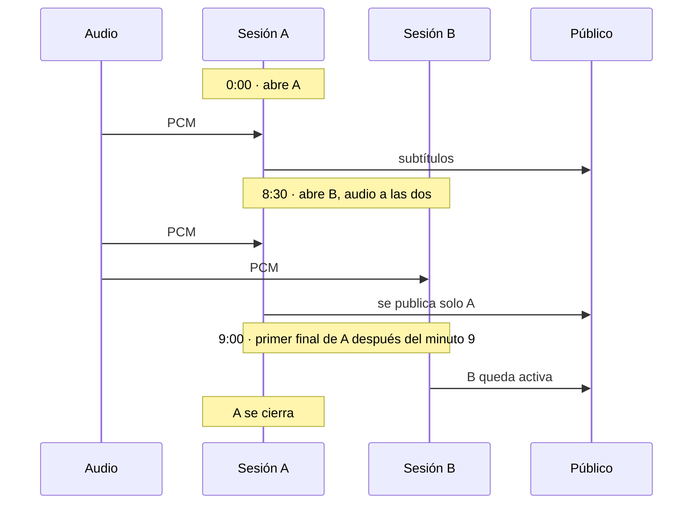

<div align="center">


# NejoyT

### Subtitulado y Traducción en Vivo para Conferencias

**Transcripción y traducción simultánea a escala, para eventos con varias salas en paralelo**  
Sin cortes de sesión · Glosario técnico en caliente · Cloud o 100% local

<br/>

)


<br/>

**Pensado para: Nerdearla 2026**

</div>

---

## ✨ ¿Qué es NejoyT?

NejoyT es un sistema de subtitulado en vivo desarrollado en **Python (FastAPI + asyncio)** que transcribe y traduce el audio de una conferencia en tiempo real, con soporte para **múltiples salas simultáneas**.

Una charla puede durar lo que dure: el audio **no se corta** cuando la sesión de streaming llega a su límite de tiempo, gracias a una rotación de sesiones con solape que es invisible para el público.

> 🌐 Open source, pensado para eventos comunitarios: sin hardware propio ni suscripción por hora y por sala.

---

## 🚀 Características principales

<table>
<tr>
<td width="50%" valign="top">

### 🏗️ Arquitectura por salas
Un `SessionWorker` por sala activa:
- **Audio** — captura y normalización vía FFmpeg
- **ASR** — reconocimiento cloud o local
- **Bus** — distribución de eventos en memoria

</td>
<td width="50%" valign="top">

### 🔌 Dos backends
| Backend | Motor | Ideal para |
|:-------:|:-----:|:-----------|
| **Cloud** | Gemini Live | Máxima precisión |
| **Local** | faster-whisper | Sin cuota, offline |

</td>
</tr>
<tr>
<td width="50%" valign="top">

### ⚡ Sin cortes de sesión
- Rotación A/B con solape de 30 s
- Relevo sobre una oración ya cerrada
- Sin tope de duración en modo local

</td>
<td width="50%" valign="top">

### 📖 Glosario técnico en caliente
- *Kubernetes*, *Docker*, *FastAPI* no se "interpretan"
- Editable con la sala ya en vivo
- Aplicado también en la traducción

</td>
</tr>
</table>

---

## 🏛️ Arquitectura del proyecto

```text
┌───────────────────────────────────────────────────────────────────┐
│                              NejoyT                                │
├───────────────┬───────────────────────┬─────────────────────────┤
│    AUDIO      │          ASR          │       DISTRIBUCIÓN       │
│   (FFmpeg)     │  Cloud / Local + Trad │      EventBus + Web      │
│               │                       │                           │
│  source.py    │   asr/rotation.py     │   bus.py                 │
│  Cola 5 s     │   translate/*.py      │   /room · overlay · SRT  │
└───────┬───────┴───────────┬───────────┴───────────┬───────────────┘
        │                   │                       │
        │      PCM 16 kHz mono, trozos de 100 ms     │
        │                   │                       │
        ▼                   ▼                       ▼
  Mic / RTMP / HLS   Gemini / Whisper      Audiencia · OBS · SRT/VTT
```

```text
NejoyT/
├── main.py                 # Aplicación FastAPI
├── orchestrator.py         # SessionWorker por sala activa
├── bus.py                  # EventBus en memoria
├── rooms.yaml              # Salas semilla (fuente, backend, idioma)
├── .env.example
├── audio/
│   └── source.py            # FFmpeg, normalización, cola y reconexión
├── asr/
│   └── rotation.py          # SeamlessRotationASR — sesiones A/B
├── translate/
│   └── gemini_text.py       # Traducción cloud de la oración cerrada
├── samples/                 # Audio de prueba sin micrófono
└── start.bat                 # Atajo de Docker en Windows
```

---

## 🛠️ Requisitos del sistema

| Requisito | Detalle |
|:----------|:--------|
| 🖥️ **SO** | Windows, Linux o macOS |
| 🎞️ **FFmpeg** | Obligatorio — tiene que estar en el `PATH` (la imagen de Docker ya lo incluye) |
| 🐍 **Python** | Solo si usás el método sin Docker → 3.12 con [uv](https://github.com/astral-sh/uv) |
| 🔑 **Gemini API Key** | Opcional — sin ella el sistema queda 100% en local |
| 🎮 **GPU** | Opcional — acelera el backend local (CUDA, ROCm o Apple Silicon); si no hay, corre en CPU |

> ⚠️ **Importante:** sin `GEMINI_API_KEY` en `.env`, NejoyT no falla: simplemente opera en modo **local**, con faster-whisper y traducción en la misma máquina.

---

## 📦 Dos formas de arrancar

Elegí la que se adapte a vos:

| Método | ¿Para quién? | ¿Qué necesitás? |
|:------:|:-------------|:----------------|
| **A · Docker (recomendado)** | Solo querés levantarlo y usarlo | Docker |
| **B · Consola (uv)** | Desarrollo, modificar backends o glosarios | Python 3.12 + uv + FFmpeg |

```text
                    ┌──────────────────────────┐
                    │  ¿Solo querés levantarlo? │
                    └────────────┬─────────────┘
                       sí │              │ no / soy dev
                          ▼              ▼
                 ┌────────────────┐  ┌─────────────────┐
                 │  Método A      │  │  Método B       │
                 │  Docker        │  │  uv + consola   │
                 └───────┬────────┘  └────────┬────────┘
                         │                    │
                         └──────────┬─────────┘
                                    ▼
                    ┌───────────────────────────────┐
                    │   + .env (Gemini opcional)     │
                    │   = NejoyT listo para usar     │
                    └───────────────────────────────┘
```

---

### 🟢 Método A — Docker (recomendado)

Ideal si **solo querés levantar el servicio** sin instalar Python a mano.

#### 1. Configurar variables de entorno

```bash
cp .env.example .env
```

> `GEMINI_API_KEY` vacía = el sistema opera 100% en local, sin costo.

#### 2. Levantar el contenedor

```bash
docker compose up --build -d
docker compose logs -f nejoyt
```

En Windows también vale doble clic en **`start.bat`**.

Para bajar el servicio:

```bash
docker compose down
```

> La imagen ya trae **FFmpeg** incluido — no hace falta instalarlo aparte.

#### 3. Usar NejoyT

Con el contenedor arriba, seguí directo a la sección [Cómo usarlo y probar que funciona](#-cómo-usarlo-y-probar-que-funciona).

<div align="center">

✅ Con Docker y el `.env` configurado, ya podés crear salas y **probar** NejoyT de punta a punta.

</div>

---

### 🔵 Método B — Instalación por consola (con `uv`)

Para desarrollo, modificar el código o correr sin contenedores.

#### 1. Clonar el repositorio

```bash
git clone https://github.com/TuUsuario/NejoyT.git
cd NejoyT
```

#### 2. Instalar dependencias con uv

```bash
uv sync
```

#### 3. Configurar variables de entorno

```bash
cp .env.example .env
```

**`.env` mínimo:**

```env
GEMINI_API_KEY=""                        # vacío = 100 % local
GEMINI_LIVE_MODEL="gemini-3.5-transcribe-live"
GEMINI_TRANSLATE_MODEL="gemini-3.5-flash-lite"
ADMIN_TOKEN="nerdearla2026"
LOG_LEVEL="INFO"
PORT=8000
```

#### 4. Verificar que FFmpeg esté en el PATH

El arranque lo busca automáticamente en Windows, Linux y macOS. Si falta, instalalo desde tu gestor de paquetes habitual.

#### 5. Ejecutar desde consola

```bash
uv run uvicorn main:app --port 8000
```

Si todo está bien, el servicio queda arriba en `http://localhost:8000`.

---

## 🎮 Cómo usarlo y probar que funciona

En **ambos métodos** el flujo de prueba es el mismo: crear una sala, elegir la fuente de audio y ver los subtítulos en vivo.

```text
┌──────────────┐      Mic / archivo /      ┌──────────────┐
│  Fuente de    │      RTMP / HLS          │   NejoyT      │
│  audio        │  ───────────────────►   │  (FastAPI)    │
└──────────────┘                          └──────┬────────┘
                                                  │
                                                  ▼
                                    Audiencia · OBS · SRT/VTT
```

### Checklist de prueba

| # | Paso | Estado |
|:-:|:-----|:------:|
| 1 | NejoyT levantado (Docker **o** `uv run uvicorn`) | ☐ |
| 2 | `/admin` accesible en `http://localhost:8000/admin` | ☐ |
| 3 | Sala creada (micrófono, archivo o RTMP/HLS) y en **Iniciar** | ☐ |
| 4 | Audiencia abierta en `/room/<id-de-sala>` | ☐ |
| 5 | (Opcional) Overlay de OBS en `/room/<id-de-sala>?overlay=1` | ☐ |
| 6 | Se ven subtítulos en menos de 1 segundo | ☐ |
| 7 | Al cerrar, se exporta el SRT/VTT correctamente | ☐ |

### Probar con el audio de ejemplo

`samples/` ya trae audio y `rooms.yaml` carga las salas en `STANDBY`.

1. Abrí `http://localhost:8000/admin`.
2. En **Auditorio Principal** (modo local), **Iniciar**.
3. Audiencia: `http://localhost:8000/room/auditorio-principal`
4. Overlay para OBS: `http://localhost:8000/room/auditorio-principal?overlay=1`
5. Al cerrar, exportá el SRT: `http://localhost:8000/api/rooms/auditorio-principal/export?format=srt`

### Fuentes de audio

| Fuente | Ventaja | Notas |
|:------:|:--------|:------|
| 🎤 **Micrófono** | Directo, sin dependencias externas | Windows lista dispositivos DirectShow; Linux, Pulse y ALSA |
| 📡 **RTMP / HLS** | Se integra con OBS o la mesa de sonido | URI tipo `rtmp://0.0.0.0:1935/live/auditorio1` |
| 📁 **Archivo** | Ideal para pruebas | Usa el audio de `samples/` |

### Configurar el overlay en OBS

1. Agregá una fuente **Navegador**.
2. Apuntala a: `http://<host>:8000/room/<id-de-sala>?overlay=1`
3. El fondo es transparente — el texto es el mismo que ve la audiencia.

---

## 🌀 Rotación con solape (sin cortes de sesión)

`gemini-3.5-transcribe-live` cierra el WebSocket a los **10 minutos**. NejoyT hace el relevo antes, sobre una frase ya cerrada, para que el público nunca note el cambio.

| Momento | Qué pasa | Qué ve el público |
|:-------:|:---------|:-------------------|
| 0:00 | Abre la sesión A | Los subtítulos de A |
| 8:30 | Abre la sesión B — el mismo audio entra en A y B | Sigue viendo solo A |
| 9:00 | Primer final de A pasados los 9 minutos | B pasa a ser la sesión activa; A se cierra limpia |
| 9:00 + | El ciclo se repite con el par siguiente | Una charla de cualquier duración |


```mermaid
sequenceDiagram
    participant Audio
    participant A as Sesión A
    participant B as Sesión B
    participant Público

    Note over A: 0:00 · abre A
    Audio->>A: PCM
    A->>Público: subtítulos

    Note over A,B: 8:30 · abre B, audio a las dos
    Audio->>A: PCM
    Audio->>B: PCM
    A->>Público: se publica solo A

    Note over A,B: 9:00 · primer final de A después del minuto 9
    B->>Público: B queda activa
    Note over A: A se cierra
```

> En modo **local** no hay tope de 10 minutos — la rotación es un mecanismo exclusivo del backend cloud.

---

## 🧰 Stack tecnológico

<div align="center">

| Capa | Tecnología | Rol |
|:----:|:-----------|:----|
| ⚙️ Backend | **FastAPI + asyncio** | Servidor web y orquestación por sala |
| 🎙️ ASR Cloud | **gemini-3.5-transcribe-live** | Transcripción vía WebSocket |
| 🎙️ ASR Local | **faster-whisper + Silero VAD** | Reconocimiento sin cuota |
| 🌍 Traducción | **Gemini Flash / CTranslate2 · MarianMT** | Traducción de la oración cerrada |
| 🎞️ Audio | **FFmpeg** | Normalización a PCM 16 kHz mono |
| 📡 Distribución | **EventBus (asyncio.Queue)** | Publicación en vivo a sala, overlay y export |

</div>

---

## ⚖️ Escala

Un solo proceso Python sostiene entre **10 y 15 salas** con menos de **250 MB** de RAM, porque la carga es de I/O (WebSockets y `asyncio`) y no de cómputo pesado — FFmpeg solo remuestrea a 16 kHz mono.

Para 20 salas o más, se recomienda un contenedor por grupo de salas, repartiendo los IDs por variables de entorno o Compose.

---

## 🩺 Cuando algo no arranca

| Síntoma | Dónde mirar |
|:--------|:------------|
| La sala cloud no transcribe | `GEMINI_API_KEY` vacía la deja en local. Para cloud, la clave tiene que estar en `.env` |
| FFmpeg no aparece en modo nativo | Tiene que estar en el `PATH`. La imagen de Docker ya lo incluye |
| El subtítulo se atrasa y después "salta" | La cola guarda 5 s; pasado eso, descarta el audio viejo a propósito para priorizar el presente |
| A los 10 minutos la nube corta | Es el límite del WebSocket — con la rotación activa, el relevo ocurre a los 9:00, sobre una oración ya cerrada |
| Un término técnico sale traducido | Agregalo al glosario de esa sala; se puede hacer con la sala en vivo |
| El log no dice qué GPU usa | En local, el arranque escribe el dispositivo y la precisión — buscá la línea `Backend local corriendo en` |

---

## 🆕 Últimas actualizaciones

- **Filtro antirepetidor:** supresión activa de texto duplicado durante la rotación A/B; los subtítulos de la sesión en espera se descartan hasta el cierre exacto de la frase.
- **Protección de cuota Free Tier:** traducción limitada a frases finales cerradas (`is_final=True`), con caché en memoria de 500 entradas.
- **Traducción resiliente (Gemini 3.6 Flash):** fallback automático y timeout extendido a 12 s ante saturación (503) o límites de peticiones diarias (429).
- **WebSockets estables:** handshake robusto en `/ws/{id}` y panel `/admin` simplificado para mínima latencia en vivo.

---

## 📄 Licencia y créditos

**Vibeathon — Nerdearla 2026**

Apache 2.0. El texto completo está en [LICENSE](LICENSE).

<div align="center">


**NejoyT** — *Que ninguna charla se quede sin subtítulos.*

<br/>

⭐ Si este proyecto te resulta útil, ¡dale una estrella al repositorio!

</div>
